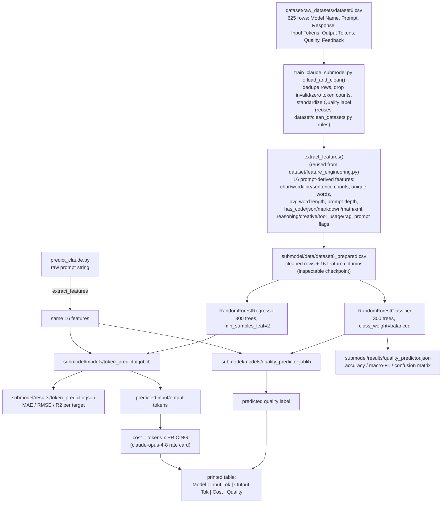

# Claude-only sub-model

A scoped-down version of the main SAGE pipeline (see repo-root `README.md`)
that trains exclusively on `dataset/raw_datasets/dataset6.csv` — the
claude-opus-4-8 rows. The main pipeline pools all six models together and
one-hot encodes "model" as a feature; this sub-model skips that entirely
since every row is already the same model, trading the cross-model
comparison table for predictors specialized to Claude's token/quality
behavior.

## Workflow



## Files

| File | Role |
| --- | --- |
| `train_claude_submodel.py` | Cleans dataset6, engineers features, trains + evaluates both models, writes everything below |
| `predict_claude.py` | CLI: takes a prompt, prints predicted tokens/cost/quality using the trained models |
| `data/dataset6_prepared.csv` | Generated. Cleaned rows + engineered features — inspect this to debug either model |
| `models/token_predictor.joblib` | Generated. Fitted `RandomForestRegressor` |
| `models/quality_predictor.joblib` | Generated. Fitted `RandomForestClassifier` |
| `results/token_predictor.json` | Generated. Held-out regression metrics |
| `results/quality_predictor.json` | Generated. Held-out classification metrics |

## The two models

### 1. Token predictor (regression)

| | |
| --- | --- |
| **Algorithm** | `RandomForestRegressor` (300 trees) |
| **Input (X)** | 16 prompt features (no model column — always Claude) |
| **Output (y)** | `input_tokens`, `output_tokens` (multi-output regression) |
| **Trained on** | 500 rows |
| **Tested on** | 125 rows (held out) |

| Target | MAE | RMSE | R² |
| --- | --- | --- | --- |
| `input_tokens` | 1.69 | 5.77 | **0.79** |
| `output_tokens` | 30.59 | 48.44 | **-0.13** |

`input_tokens` predicts well — it's driven almost entirely by `char_count`
(prompt length). `output_tokens` is effectively unpredictable from prompt
features alone at this sample size (negative R² = worse than predicting the
mean every time); response length depends on what Claude chose to say, not
just what was asked.

Top features (both targets, impurity importance): `char_count` (0.49) →
`avg_word_length` (0.21) → `word_count` (0.13) → `unique_words` (0.08).

### 2. Quality predictor (classification)

| | |
| --- | --- |
| **Algorithm** | `RandomForestClassifier` (300 trees, `class_weight="balanced"`) |
| **Input (X)** | same 16 prompt features |
| **Output (y)** | `quality` ∈ {Bad, Average, Good} — no "Excellent" rows exist in dataset6 |
| **Trained on** | 500 rows |
| **Tested on** | 125 rows (held out) |

**Accuracy: 0.47   Macro-F1: 0.36**

| Class | Support | Precision | Recall | F1 |
| --- | --- | --- | --- | --- |
| Bad | 6 | 0.07 | 0.17 | 0.10 |
| Average | 80 | 0.63 | 0.50 | 0.56 |
| Good | 39 | 0.38 | 0.46 | 0.42 |

The `Bad` class has only 28 examples total (6 in the test split) — not
enough signal for the model to learn it reliably, which drags down the
macro-F1 despite reasonable `Average`/`Good` performance.

> These numbers reflect 625 rows. The main pipeline's combined model
> (`results/rf/`) is trained on ~6x more data and should be treated as the
> stronger general-purpose predictor; this sub-model exists to see whether
> Claude-specific patterns get lost in the pooled model, not to beat it on
> raw accuracy.

## Usage

```bash
# Clean -> feature engineer -> train both models -> save models + metrics
uv run python submodel/train_claude_submodel.py

# Predict tokens/cost/quality for a prompt using the trained sub-model
uv run python submodel/predict_claude.py "Explain how transformers work"
```

Example output:

```
Model                Input Tok  Output Tok      Cost     Quality
claude-opus-4-8             11          72   $0.0056        Good
```
